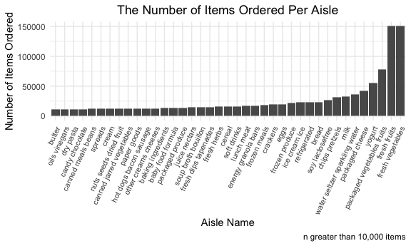

p8105_hw3_LCA2149
================
2025-10-06

## Question 1

``` r
library(p8105.datasets)
data("instacart")
```

The `instacart` dataset has 15 variables including order ID, product ID,
add to cart order, etc, 1,384,617 rows that represent 131,209 distinct
orders, and 20,769,255 total observations.

There are 134 different aisles and the most popular are
`fresh vegetables`, `fresh fruits`, and `packaged vetetable fruits`
respectively.

``` r
instacart |>
  count(aisle) |>
  filter(n > 10000) |>
  ggplot(aes(x = reorder(aisle, n), y = n)) +
  geom_col() +
  theme(axis.text.x = element_text(angle = 65, hjust = 1, size=8))+
  labs(
    x="Aisle Name", 
    y="Number of Items Ordered",
    title="The Number of Items Ordered Per Aisle",
    caption = "n greater than 10,000 items"
    ) +
  theme(plot.title = element_text(hjust = 0.5))
```



``` r
instacart |>
  filter(aisle == "baking ingredients" | aisle == "dog food care" | aisle == "packaged vegetables fruits") |>
  count(aisle, product_name) |>
  group_by(aisle) |>
  slice_max(n, n = 3) |>
   knitr::kable()
```

| aisle | product_name | n |
|:---|:---|---:|
| baking ingredients | Light Brown Sugar | 499 |
| baking ingredients | Pure Baking Soda | 387 |
| baking ingredients | Cane Sugar | 336 |
| dog food care | Snack Sticks Chicken & Rice Recipe Dog Treats | 30 |
| dog food care | Organix Chicken & Brown Rice Recipe | 28 |
| dog food care | Small Dog Biscuits | 26 |
| packaged vegetables fruits | Organic Baby Spinach | 9784 |
| packaged vegetables fruits | Organic Raspberries | 5546 |
| packaged vegetables fruits | Organic Blueberries | 4966 |

``` r
instacart |>
  filter(product_name == "Pink Lady Apples" | product_name == "Coffee Ice Cream") |>
  group_by(product_name, order_dow) |>
  summarize(mean_hour = mean(order_hour_of_day), .groups = 'drop') |>
  mutate(
    order_dow = case_when(
      order_dow == 0 ~ "Sunday",
      order_dow == 1 ~ "Monday", 
      order_dow == 2 ~ "Tuesday",
      order_dow == 3 ~ "Wednesday",
      order_dow == 4 ~ "Thursday",
      order_dow == 5 ~ "Friday",
      order_dow == 6 ~ "Saturday"
    ),
    clock_time = paste0(floor(mean_hour), ":", sprintf("%02d", round((mean_hour - floor(mean_hour)) * 60)))
  ) |>
  select(product_name, order_dow, clock_time) |>
   pivot_wider(names_from = order_dow, values_from = clock_time) |>
   knitr::kable()
```

| product_name     | Sunday | Monday | Tuesday | Wednesday | Thursday | Friday | Saturday |
|:-----------------|:-------|:-------|:--------|:----------|:---------|:-------|:---------|
| Coffee Ice Cream | 13:46  | 14:19  | 15:23   | 15:19     | 15:13    | 12:16  | 13:50    |
| Pink Lady Apples | 13:26  | 11:22  | 11:42   | 14:15     | 11:33    | 12:47  | 11:56    |
