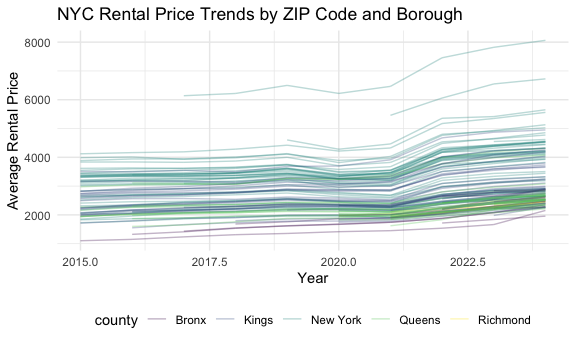
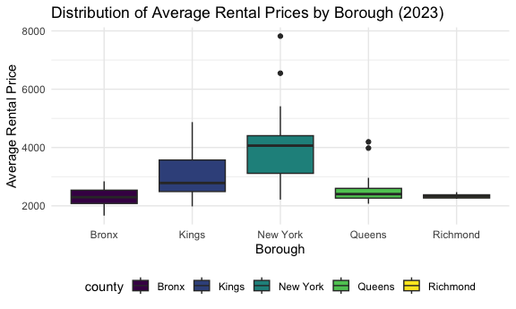
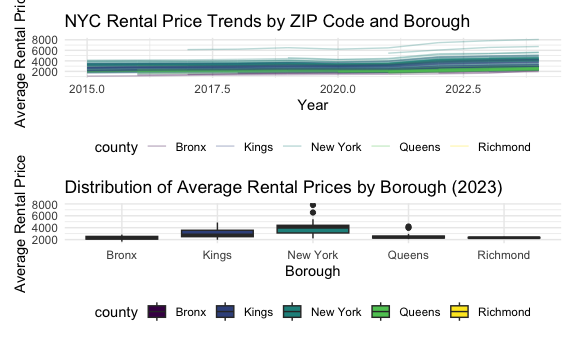
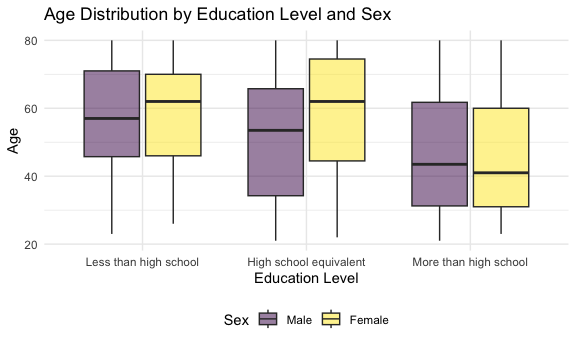
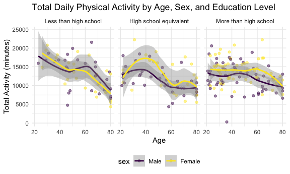
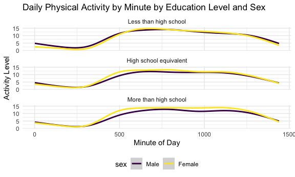

p8105_hw3_LCA2149
================
2025-10-06

## Question 1

``` r
library(p8105.datasets)
data("instacart")
```

The `instacart` dataset has 15 variables including order ID, product ID,
add to cart order, etc, 1,384,617 rows that represent 131,209 distinct
orders, and 20,769,255 total observations.

There are 134 different aisles and the most popular are
`fresh vegetables`, `fresh fruits`, and `packaged vetetable fruits`
respectively.

``` r
instacart |>
  count(aisle) |>
  filter(n > 10000) |>
  ggplot(aes(x = reorder(aisle, n), y = n)) +
  geom_col() +
  theme(axis.text.x = element_text(angle = 65, hjust = 1, size=8))+
  labs(
    x="Aisle Name", 
    y="Number of Items Ordered",
    title="The Number of Items Ordered Per Aisle",
    caption = "n greater than 10,000 items"
    ) +
  theme(plot.title = element_text(hjust = 0.5))
```


The most common aisles include fresh vegetables and fresh fruits. The
least common is butter.

``` r
instacart |>
  filter(aisle == "baking ingredients" | aisle == "dog food care" | aisle == "packaged vegetables fruits") |>
  count(aisle, product_name) |>
  group_by(aisle) |>
  slice_max(n, n = 3) |>
   knitr::kable()
```

| aisle | product_name | n |
|:---|:---|---:|
| baking ingredients | Light Brown Sugar | 499 |
| baking ingredients | Pure Baking Soda | 387 |
| baking ingredients | Cane Sugar | 336 |
| dog food care | Snack Sticks Chicken & Rice Recipe Dog Treats | 30 |
| dog food care | Organix Chicken & Brown Rice Recipe | 28 |
| dog food care | Small Dog Biscuits | 26 |
| packaged vegetables fruits | Organic Baby Spinach | 9784 |
| packaged vegetables fruits | Organic Raspberries | 5546 |
| packaged vegetables fruits | Organic Blueberries | 4966 |

The most popular products from the baking ingredient aisle are light
brown sugar, pure baking soda, and cane sugar. The most popular products
from the dog food care aisle iare snack sticks chicken and rice recipe
dog treats, organiz chicken and brown rice recipe, and small dog
biscuits. And from the packaged vegetables fruits aisle are organic baby
spinach, organic raspberries, and organic blueberries.

``` r
instacart |>
  filter(product_name == "Pink Lady Apples" | product_name == "Coffee Ice Cream") |>
  group_by(product_name, order_dow) |>
  summarize(mean_hour = mean(order_hour_of_day), .groups = 'drop') |>
  mutate(
    order_dow = case_when(
      order_dow == 0 ~ "Sunday",
      order_dow == 1 ~ "Monday", 
      order_dow == 2 ~ "Tuesday",
      order_dow == 3 ~ "Wednesday",
      order_dow == 4 ~ "Thursday",
      order_dow == 5 ~ "Friday",
      order_dow == 6 ~ "Saturday"
    ),
    clock_time = paste0(floor(mean_hour), ":", sprintf("%02d", round((mean_hour - floor(mean_hour)) * 60)))
  ) |>
  select(product_name, order_dow, clock_time) |>
   pivot_wider(names_from = order_dow, values_from = clock_time) |>
   knitr::kable()
```

| product_name     | Sunday | Monday | Tuesday | Wednesday | Thursday | Friday | Saturday |
|:-----------------|:-------|:-------|:--------|:----------|:---------|:-------|:---------|
| Coffee Ice Cream | 13:46  | 14:19  | 15:23   | 15:19     | 15:13    | 12:16  | 13:50    |
| Pink Lady Apples | 13:26  | 11:22  | 11:42   | 14:15     | 11:33    | 12:47  | 11:56    |

Coffee ice cream is ordered later in the day on average than pink lady
apples every day of the week besides Fridays.

## Question 2

Import Zip Code data

``` r
Zipcode_df=
  read_csv("data/Zip Codes.csv", na = c("NA", ".", "")) |>
  janitor::clean_names() 
```

    ## Rows: 322 Columns: 7
    ## ── Column specification ────────────────────────────────────────────────────────
    ## Delimiter: ","
    ## chr (4): County, County Code, File Date, Neighborhood
    ## dbl (3): State FIPS, County FIPS, ZipCode
    ## 
    ## ℹ Use `spec()` to retrieve the full column specification for this data.
    ## ℹ Specify the column types or set `show_col_types = FALSE` to quiet this message.

Import Zip_zori

``` r
Zipzori_df =
  read_csv("data/Zip_zori_uc_sfrcondomfr_sm_month_NYC.csv", 
           na = c("NA", ".", "")) |>
  janitor::clean_names() |>
  pivot_longer(
    cols=starts_with("x20"),
    names_to="date",
    values_to="zillow_value"
  ) |>
  mutate(
    date = as.Date(gsub("x", "", gsub("_", "-", date)))
  ) |>
  select(
    zip_code=region_name,
    date, zillow_value,
    everything())
```

    ## Rows: 149 Columns: 125
    ## ── Column specification ────────────────────────────────────────────────────────
    ## Delimiter: ","
    ## chr   (6): RegionType, StateName, State, City, Metro, CountyName
    ## dbl (119): RegionID, SizeRank, RegionName, 2015-01-31, 2015-02-28, 2015-03-3...
    ## 
    ## ℹ Use `spec()` to retrieve the full column specification for this data.
    ## ℹ Specify the column types or set `show_col_types = FALSE` to quiet this message.

Merge

``` r
Zillow_df =
  left_join(Zipzori_df, Zipcode_df, by="zip_code") 
```

    ## Warning in left_join(Zipzori_df, Zipcode_df, by = "zip_code"): Detected an unexpected many-to-many relationship between `x` and `y`.
    ## ℹ Row 4757 of `x` matches multiple rows in `y`.
    ## ℹ Row 256 of `y` matches multiple rows in `x`.
    ## ℹ If a many-to-many relationship is expected, set `relationship =
    ##   "many-to-many"` to silence this warning.

``` r
Zillow_df |>
 count(zip_code) |>
  filter(n == 116) |>
  nrow()
```

    ## [1] 147

``` r
Zillow_df |>
 count(zip_code) |>
  filter(n < 10) |>
  nrow()
```

    ## [1] 0

There are 147 zip codes that were observed 116 times and 0 zip codes
that were observed less than 10 times. Of the 147 zip codes observed
every month, these may include well established neighborhoods with
stable housing markets that have reliable data tracking methods. The
fact that there are 0 zip codes that are observed less than 10 times
means that the data was filtered that way and/or represents only markets
that have consistent reporting.

``` r
Zillow_df |>
 mutate(year = year(date)) |>
  group_by(county, year) |>
  summarize(avg_rent = mean(zillow_value, na.rm = TRUE), .groups = 'drop') |>
  pivot_wider(names_from = year, values_from = avg_rent) |>
  knitr::kable(digits = 0)
```

| county   | 2015 | 2016 | 2017 | 2018 | 2019 | 2020 | 2021 | 2022 | 2023 | 2024 |
|:---------|-----:|-----:|-----:|-----:|-----:|-----:|-----:|-----:|-----:|-----:|
| Bronx    | 1760 | 1520 | 1544 | 1639 | 1706 | 1811 | 1858 | 2054 | 2285 | 2497 |
| Kings    | 2493 | 2520 | 2546 | 2547 | 2631 | 2555 | 2550 | 2868 | 3015 | 3126 |
| New York | 3006 | 3015 | 3109 | 3160 | 3285 | 3091 | 3124 | 3753 | 3908 | 4053 |
| Queens   | 2215 | 2272 | 2263 | 2292 | 2388 | 2316 | 2211 | 2406 | 2562 | 2694 |
| Richmond |  NaN |  NaN |  NaN |  NaN |  NaN | 1978 | 2045 | 2147 | 2333 | 2536 |

We can see that rent has increased across all boroughs long-term, with a
dip in all in 2020 during the pandemic. Overall Manhattan continued to
have the highest average rent across the years, and the Bronx with the
lowest.

``` r
Zillow_df |>
  mutate(year = year(date)) |>
  group_by(county, zip_code, year) |>
  summarize(avg_rent = mean(zillow_value, na.rm = TRUE), .groups = 'drop') |>
  ggplot(aes(x = year, y = avg_rent, group = zip_code, color=county)) +
  geom_line(alpha=0.3) +
  labs(
    title = "NYC Rental Price Trends by ZIP Code and Borough",
    x = "Year",
    y = "Average Rental Price"
  ) 
```

    ## Warning: Removed 531 rows containing missing values or values outside the scale range
    ## (`geom_line()`).


This plot represents each individual zip code across the five boroughs
and shows the variation in average rental price. Although this is dense,
we can see a clear decrease across all counties around the time of the
pandemic.

``` r
Zillow_df |>
  filter(year(date) == 2023) |>
  group_by(county, zip_code, month = month(date)) |>
  summarize(avg_rent = mean(zillow_value, na.rm = TRUE), .groups = 'drop') |>
  group_by(county, zip_code) |>
  summarize(annual_avg_rent = mean(avg_rent, na.rm = TRUE), .groups = 'drop') |>
  ggplot(aes(x = county, y = annual_avg_rent, fill = county)) +
  geom_boxplot() +
  labs(
    title = "Distribution of Average Rental Prices by Borough (2023)",
    x = "Borough",
    y = "Average Rental Price" )
```

    ## Warning: Removed 24 rows containing non-finite outside the scale range
    ## (`stat_boxplot()`).


Manhattan has the greatest average rental price, followed by Kings
(Brooklyn), Queens, Richmond (Staton Island), and the Bronx.

``` r
plot_trend <- Zillow_df |>
  mutate(year = year(date)) |>
  group_by(county, zip_code, year) |>
  summarize(avg_rent = mean(zillow_value, na.rm = TRUE), .groups = 'drop') |>
  ggplot(aes(x = year, y = avg_rent, group = zip_code, color=county)) +
  geom_line(alpha=0.3) +
  labs(
    title = "NYC Rental Price Trends by ZIP Code and Borough",
    x = "Year",
    y = "Average Rental Price") 

plot_2023 <- Zillow_df |>
  filter(year(date) == 2023) |>
  group_by(county, zip_code, month = month(date)) |>
  summarize(avg_rent = mean(zillow_value, na.rm = TRUE), .groups = 'drop') |>
  group_by(county, zip_code) |>
  summarize(annual_avg_rent = mean(avg_rent, na.rm = TRUE), .groups = 'drop') |>
  ggplot(aes(x = county, y = annual_avg_rent, fill = county)) +
  geom_boxplot() +
  labs(
    title = "Distribution of Average Rental Prices by Borough (2023)",
    x = "Borough",
    y = "Average Rental Price" )

library(patchwork)
combined_plot <- plot_trend / plot_2023
print(combined_plot)
```

    ## Warning: Removed 531 rows containing missing values or values outside the scale range
    ## (`geom_line()`).

    ## Warning: Removed 24 rows containing non-finite outside the scale range
    ## (`stat_boxplot()`).



``` r
ggsave("results/nyc_rental_analysis.png", combined_plot, width = 12, height = 10)
```

    ## Warning: Removed 531 rows containing missing values or values outside the scale range
    ## (`geom_line()`).
    ## Removed 24 rows containing non-finite outside the scale range
    ## (`stat_boxplot()`).

## Question 3

Load, tidy, and merge the two datasets.

``` r
accel_df =
  read_csv("data/nhanes_accel.csv") |>
  janitor::clean_names() 
```

    ## Rows: 250 Columns: 1441
    ## ── Column specification ────────────────────────────────────────────────────────
    ## Delimiter: ","
    ## dbl (1441): SEQN, min1, min2, min3, min4, min5, min6, min7, min8, min9, min1...
    ## 
    ## ℹ Use `spec()` to retrieve the full column specification for this data.
    ## ℹ Specify the column types or set `show_col_types = FALSE` to quiet this message.

``` r
covar_df = 
  read_csv("data/nhanes_covar.csv", skip=4) |>
    janitor::clean_names() |>
  mutate(sex = factor(sex, 
                levels = c(1, 2),
                labels = c("Male", "Female")),
    education = factor(education,
                      levels = c(1, 2, 3),
                      labels = c("Less than high school", 
                                "High school equivalent", 
                                "More than high school"),
                      ordered = TRUE),
  ) |>
  filter(age >= 21) |>
  drop_na(sex, age, education)
```

    ## Rows: 250 Columns: 5
    ## ── Column specification ────────────────────────────────────────────────────────
    ## Delimiter: ","
    ## dbl (5): SEQN, sex, age, BMI, education
    ## 
    ## ℹ Use `spec()` to retrieve the full column specification for this data.
    ## ℹ Specify the column types or set `show_col_types = FALSE` to quiet this message.

Merge datasets

``` r
NHANES_df =
  left_join(covar_df, accel_df, by="seqn") 
```

Table \#1

``` r
NHANES_df |>
  count(education, sex) |>
pivot_wider(
    names_from = sex,
    values_from = n,
    values_fill = 0
  ) |>
  knitr::kable()
```

| education              | Male | Female |
|:-----------------------|-----:|-------:|
| Less than high school  |   28 |     29 |
| High school equivalent |   36 |     23 |
| More than high school  |   56 |     59 |

Graphic \#1

``` r
NHANES_df |>
  ggplot(aes(x=education, y=age, fill=sex ))+
  geom_boxplot(alpha=0.5) +
  labs(
    title = "Age Distribution by Education Level and Sex",
    x = "Education Level", 
    y = "Age",
    fill = "Sex"
  ) 
```



After taking a look at the distrubution of education level across male
and females and the distribution of age by education and sex we can make
some observations. There are a similar number of males and females with
both “less than high school” and “more than high school” educational
levels. However, there are more males with high school equivalent
educations compared to females. Secondly, for those with less than high
school education, females tend to be on average a bit older. For those
with high school equivalent educational levels, females are on average
older by about 5 years, and for those with more than high school males
are just slightly older.

``` r
NHANES_df <- NHANES_df |>
 mutate(total_activity = rowSums(across(starts_with("min")), na.rm = TRUE)) 

NHANES_df |>
  ggplot(aes(x=age, y=total_activity, color=sex)) +
  geom_point(alpha=0.5) +
  geom_smooth(method = "loess", se = TRUE) +  
  facet_wrap(~ education) +
  labs(
    x="Age",
    y="Total Activity (minutes)",
    title= "Total Daily Physical Activity by Age, Sex, and Education Level"
  )
```

    ## `geom_smooth()` using formula = 'y ~ x'



This plot compares total daily physical activity by age, sex, and
education level. Across all educational levels, physical activity
decreases with older age, and females “tend” to be more physically
active on a day to day basis. We do see a jump in daily physical
activity in both male and females with high school equivalent educations
around age 35-40.

``` r
NHANES_df |>
  pivot_longer(
    cols = starts_with("min"),
    names_to = "minute", 
    values_to = "activity"
  ) |>
  mutate(minute = as.numeric(str_remove(minute, "min"))) |>
  ggplot(aes(x = minute, y = activity, color = sex)) +
  geom_smooth(se = TRUE) +
  facet_wrap(~ education, ncol = 1) +
  labs(
    x = "Minute of Day",
    y = "Activity Level", 
    title = "Daily Physical Activity by Minute by Education Level and Sex"
  )
```

    ## `geom_smooth()` using method = 'gam' and formula = 'y ~ s(x, bs = "cs")'



This plots looks at physical activity across the entire day broken down
minute by minute by education level and sex. We see an increase across
all sexes and educational levels in the early morning as folks are
waking up and starting their day. Physical activity peaks throughout the
morning and mid-day. Activity levels start to decrease around 4:00pm.
